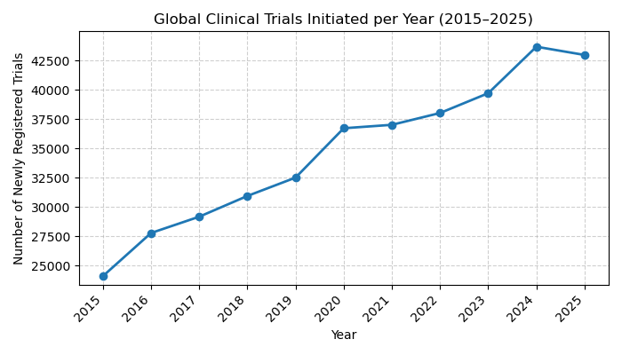
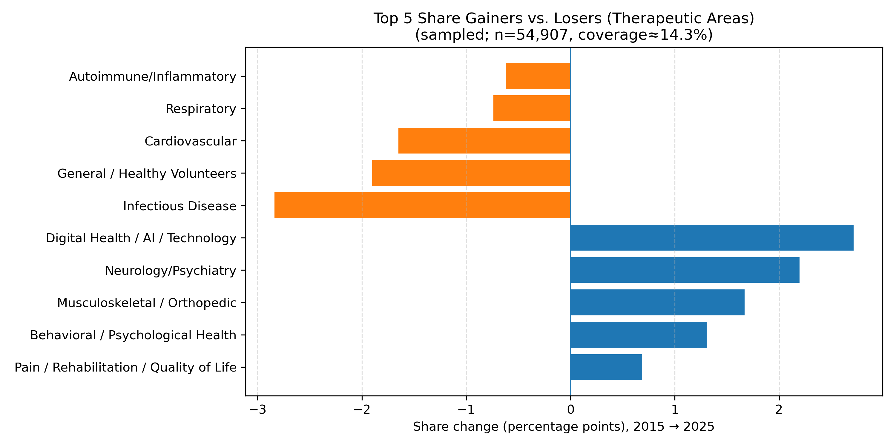
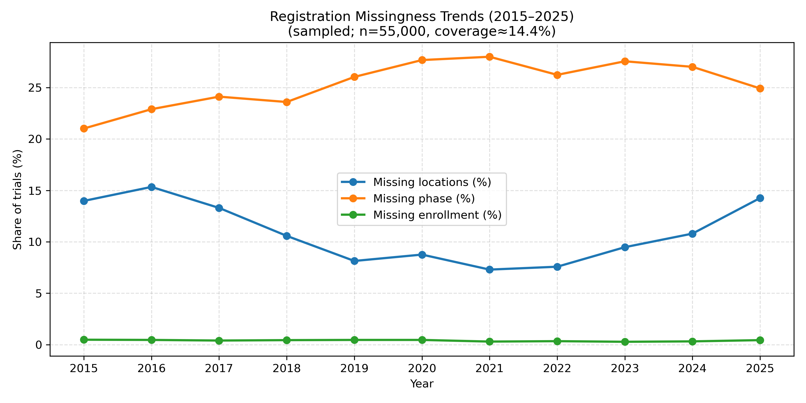

# Global Clinical Trial Trends (2015–2025)

This repository presents a **data analytics project** exploring **global clinical trial activity (2015–2025)** using open data from [ClinicalTrials.gov](https://clinicaltrials.gov/).  
The project applies **Python-based data collection, processing, and visualization** to reveal research and innovation patterns across disease areas, trial operations, and transparency indicators.

---

## Objectives
- Retrieve data from **ClinicalTrials.gov v2 API**
- Analyze **yearly registration trends** (2015–2025)
- Compare **country-level distributions**
- Classify by **therapeutic area** and track changes over time
- Quantify **growth / decline / volatility** of therapeutic areas
- Evaluate **registration completeness** and **results reporting timeliness**

---

## Modules
| # | Title | Focus |
|:-:|--------|--------|
| **01** | Global Trends by Year | Total registrations by year (2015–2025) |
| **02** | Regional Distribution & Collaboration | Trial distribution by country/region |
| **03** | Therapeutic Area Trends & Disease Focus | Therapeutic area classification + yearly shares (sampled) |
| **04** | Therapeutic Area Dynamics & Growth | Which areas gained/lost share; volatility and jumps |
| **05** | Registration Completeness & Transparency Trends | Missing fields + results reporting timeliness |

---

## Data Source
- **Source:** [ClinicalTrials.gov API v2](https://clinicaltrials.gov/api/v2/studies)  
- **Publisher:** U.S. National Library of Medicine (NLM)  
- **Access Method:** REST API (`requests` in Python)  

---

## Tools
- **Python 3.10**  
- **Environment:** Jupyter Notebook  
- **Libraries:** Pandas, Requests, Matplotlib, Seaborn  

---

## Visualization Summary

**Module 1 — Global trial volume (2015–2025)**
- 

**Module 3 — Therapeutic area distribution**
- 

**Module 4 — Share change / volatility / YoY jump**
- 

**Module 5 — Transparency & missingness**
- 
- 

---

## Author
**Dr. Hanjing Wu**  
Ph.D. in Bioengineering | M.S. Candidate in Computer Science, Syracuse University  

📧 Email: hwu188@syr.edu  
🌐 GitHub: [https://github.com/huansha2002](https://github.com/huansha2002)

---

*This repository is for educational and research purposes only.*  
*It demonstrates the use of data analytics to explore global clinical research trends.*
